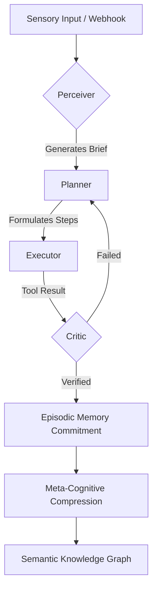

<div align="center">

# 🌊 Wave Field AGI 
**Autonomous, Evolving, Folder-Managed Intelligence**


[](#)
[](#)
[](#)
[](#)

</div>

<br/>

> **Wave Field AGI** is a production-grade cognitive engine built on the principle of **Folder-as-Workspace** memory. It treats the literal file system as a high-density sensory substrate, allowing for infinite context expansion through semantic routing rather than monolithic context windows.

---

## 🏛️ System Architecture

The core of Wave Field AGI is the **Recursive Cognitive Loop**, a four-stage process that ensures every action is contextualized, planned, executed, and criticized before commitment.

### 1. The Four Pillars of Thought
| Subsystem | Logic Layer | Function | Specialist Model |
| :--- | :--- | :--- | :--- |
| **🔍 Perceiver** | *Sensory* | Scans active `Folder Context` and user intent to generate a localized **Brief**. | `Gemma-2-9B` |
| **🧩 Planner** | *Logic* | Deconstructs Briefs into atomic, verifiable sub-goals. | `Qwen-2.5-Coder` |
| **⚙️ Executor** | *Agency* | Operates on the filesystem, executes Shell/Node commands, and modifies code. | `DeepSeek-Coder-V2` |
| **⚖️ Critic** | *Validation* | Reflects on Execution results against original constraints. Triggers backtracks if needed. | `Llama-3.1-70B` |

### 2. Multi-Layer Memory Substrate
Wave Field rejects the "flat context" approach. Instead, it utilizes a tiered memory architecture:
*   **Episodic Timeline:** A chronological log of every high-level event and tool usage stored in `data/db.json`.
*   **Procedural Memory:** A library of "Skills" (Node.js modules) that the agent can write for itself and reuse.
*   **Semantic Graph:** Extracted facts and rules turned into a directed graph for cross-task reasoning.
*   **Deep Vector RAG:** Local embedding-based retrieval for searching massive codebases or research archives.

---

## 🌀 The Cognitive Loop Mechanics

The interaction between sub-modules is strictly governed by the following state machine:



---

## 🚀 Key Features

### 📂 Folder-as-Workspace Context
Unlike traditional RAG which acts as a "search engine," **Wave Field** treats its current directory as its "World Model." Moving to a new folder shifts the agent's entire persona and knowledge base instantly.
*   **Native MD Routing:** Documentation in a folder acts as active "System Instructions" for tasks within that scope.
*   **Semantic Loading:** The `FolderContextLoader` automatically loads relevant `brief.md` and `spec.md` files upon entry.

### 🔄 Autonomous Meta-Cognition
The system features a background "Meta-Diagnostic" loop.
1.  **Diagnostic:** Scans recent episodic history for patterns of failure or stagnant progress.
2.  **Evolution:** Formulates a code change or system integration to improve its own performance.
3.  **Deployment:** Writes the fix, updates its own progress tracker, and syncs via Git.

### 🛡️ Hardened Security Layer
*   **Prompt Injection Defense:** Multi-pattern scanning for "Ignore previous instructions" payloads.
*   **DDoS Mitigation:** IP-based rate limiting (50 req/min) synchronized with cognitive logs.
*   **Sandbox Isolation:** Filesystem operations are strictly bound to recognized workspace paths.

---

## 🛠️ Setup & Configuration

### Prerequisites
-   **Node.js 20+**
-   **Ollama** (Optional, for local inference)
-   **Gemini API Key** (Required for the `free-llm-router`)

### Environment Variables
Copy `.env.example` to `.env` and configure:
```env
# Core API
GEMINI_API_KEY="your_api_key"

# Autonomous Deployment (Optional)
GITHUB_TOKEN="ghp_..."
GITHUB_REPO="username/wave-field-agi"
```

### Installation
```bash
npm install
npm run dev
```

---

## 🌟 Master Architects

This project is the culmination of theoretical breakthroughs in attention complexity and workspace management:

*   **Jake Van Clief**: Pioneer of the *Folder-as-Workspace* architecture.
*   **Avinash Badaramoni**: Creator of *Wave Field Attention* ($O(N \log N)$ complexity).
*   **RJGonzalez**: Architect of the Recursive Loop and System Orchestration.

---

<div align="center">
  <p><sub><b>V 1.2.0 — Wave Field Systems 2026</b></sub></p>
  
</div>
